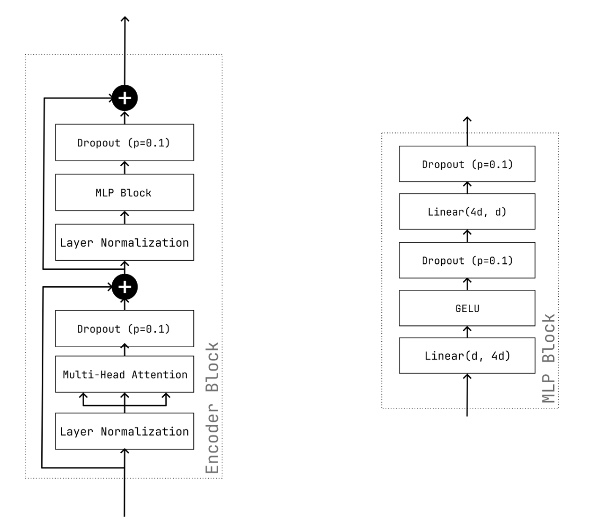
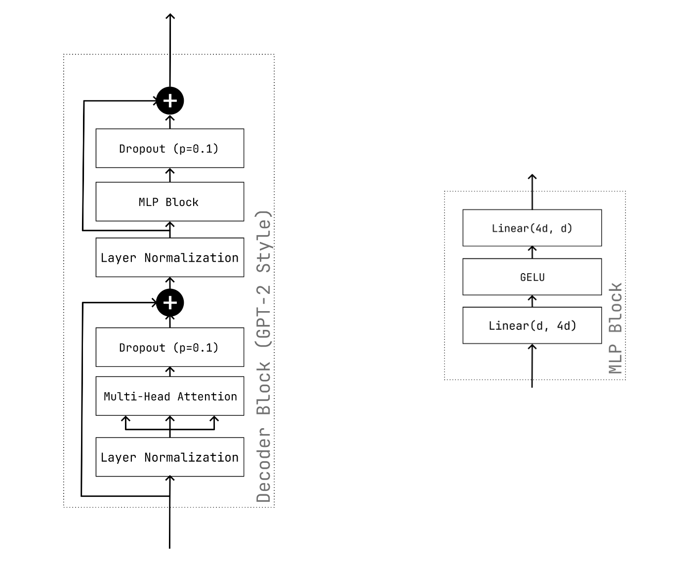
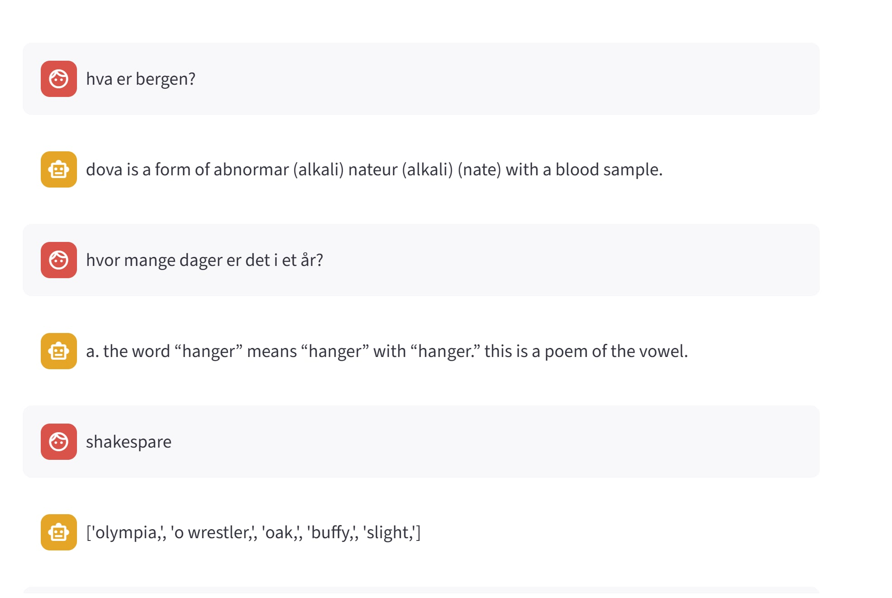

<h1 align="center">Transformer Models</h1>
<h3 align="center">INF265 – Project 3 · Jakob Berg & Tobias Munch</h3>

Two transformers implemented and trained from scratch in PyTorch, built from the
same core blocks described in *Attention is All You Need* (Vaswani et al., 2017):

1. **Part 1 — Encoder-only sentiment classifier** on the IMDb movie-review corpus.
2. **Part 2 — Decoder-only (GPT-style) chatbot** trained on a subset of the GooAQ
   question/answer corpus, with a Streamlit chat UI.

📄 Full write-up: **[report.md](report.md)** (also as [report.pdf](report.pdf)) —
split per part in [part1_report.md](part1_report.md) and [part2_report.md](part2_report.md).
Assignment text: [project_3_description.pdf](project_3_description.pdf).

---

## Repository layout

```
01_encoder_sentiment_classifier/
  imdb_sentiment_encoder.ipynb   # notebook version (Part 1)
  part1.py                       # same code as a script
  imdb_train/, imdb_test/        # cached HF datasets (gitignored)
02_decoder_chatbot/
  config.py                      # all hyperparameters in one SimpleNamespace
  tokenizer.py                   # trains the BPE tokenizer
  dataset.py                     # QADataset: question [SEP] answer [END]
  model.py                       # DecoderBlock, PositionalEncoding, TransformerModel
  train.py                       # training loop (AdamW, AMP, checkpointing)
  inference.py                   # greedy / top-p sampling
  chatbot.py                     # Streamlit chat interface
  utils.py                       # param count, config printing
  gpu_training_notebook.ipynb    # notebook used for the GPU run
  temp/                          # tokenizer.json + model/optimizer checkpoints
images/                          # figures used in the report
report.md / report.pdf           # full report
```

---

## Part 1 — Encoder-only IMDb sentiment classifier

An encoder-only transformer reads a movie review and predicts *positive* / *negative*.
A `[CLS]` token is prepended to every sequence; its final embedding is fed to a linear
head with a sigmoid output.

**Written from scratch** (only `nn.Linear`, `nn.LayerNorm`, `nn.Embedding`, `nn.Dropout`):
multi-head self-attention, the pre-norm encoder block, sinusoidal positional encoding
and the classification head.

<p align="center">
  
</p>

*One encoder block: `LayerNorm → MultiHeadAttention → Dropout → residual`, then
`LayerNorm → MLP(Linear → GELU → Dropout → Linear → Dropout) → residual`.*

**Setup**

| | |
|---|---|
| Data | 25k train / 5k val / 20k test reviews |
| Tokenizer | word-level, `vocab_size=10 000`, `min_frequency=10`, `max_length=256` |
| Model | `embedding_dim=96`, `num_layers=3`, `num_heads=4` — **1 295 617 params** |
| Training | 3 epochs, AdamW (`lr=1e-3`, `wd=1e-3`), `BCELoss`, batch 64, grad-clip 10.0 |

**Results**

| Epoch | Train Loss | Train Acc. | Val Loss | Val Acc. |
|-------|-----------|-----------|----------|----------|
| 1 | 0.5351 | 0.7120 | 0.4129 | 0.8106 |
| 2 | 0.3724 | 0.8331 | 0.3689 | 0.8368 |
| 3 | 0.3023 | 0.8726 | 0.3855 | 0.8406 |

**Test accuracy: 0.8358.** Failure modes are the expected ones for a small
word-level encoder: sarcasm, lukewarm/mixed sentiment and rare vocabulary —
see [§6 Custom Review Predictions](report.md) in the report.

**Run it**

```bash
cd 01_encoder_sentiment_classifier
jupyter notebook imdb_sentiment_encoder.ipynb   # or: python part1.py
```

The dataset directories are gitignored; recreate them once with:

```python
from datasets import load_dataset
d = load_dataset("imdb")
d["train"].save_to_disk("imdb_train"); d["test"].save_to_disk("imdb_test")
```

---

## Part 2 — Decoder-only GooAQ chatbot

An autoregressive decoder-only transformer trained on question/answer pairs.
Each block uses a **causal mask** (no attending to future tokens) plus a
**key-padding mask**; both are passed to `torch.nn.MultiheadAttention` via
`attn_mask` and `key_padding_mask`, as the assignment asks. Tokenization is
**byte-pair encoding**, so rare words decompose into subwords instead of `[UNK]`.

<p align="center">
  
</p>

**Setup**

| | |
|---|---|
| Data | 859 765 GooAQ question/answer pairs, `max_len=128` |
| Tokenizer | BPE, `vocab_size=20 000`, `min_frequency=5` |
| Model | `embed_size=512`, `num_heads=8`, `num_layers=5` — **36 261 920 params** |
| Training | 5 epochs, AdamW `lr=1e-4`, batch 128, mixed precision, ~10–11 min/epoch on GPU |

**Training loss**

| Epoch | 1 | 2 | 3 | 4 | 5 |
|---|---|---|---|---|---|
| Mean CE loss | 4.7823 | 3.8625 | 3.5208 | 3.3187 | 3.1840 |

The loss was still falling at epoch 5 with no sign of plateauing — the model is
more underfit than overfit and would have benefited from more training.

**Output quality.** Answers are largely incoherent and rarely connected to the
question. Greedy decoding loops on repeated phrases; top-p adds variety at the cost
of coherence. Asked *"what is Bergen?"* the model answered
*"dova is a form of abnormar (alkali) nateur (alkali) (nate) with blood samples"*.

<p align="center">
  
</p>

*The Streamlit chat UI. The answers are clearly wrong and often make no sense —
see the prediction analysis and improvement suggestions in the report.*

**Run it**

```bash
cd 02_decoder_chatbot
python tokenizer.py   # trains + saves temp/tokenizer.json (skipped if it exists)
python train.py       # trains the model, checkpoints every 500 batches
streamlit run chatbot.py   # chat with the trained model
```

Sampling strategy, temperature and top-p are adjustable in the Streamlit sidebar.
All hyperparameters live in [02_decoder_chatbot/config.py](02_decoder_chatbot/config.py);
it auto-selects CUDA when available and contains a commented-out tiny-model block for
CPU smoke tests. The GooAQ subset is gitignored and must be placed in
`02_decoder_chatbot/gooaq_subset` (a `datasets` directory with `question` / `answer`
columns) before training.

---

## Requirements

Python 3.12 with:

```bash
pip install torch datasets tokenizers streamlit numpy matplotlib tqdm
```

## Division of work

We worked on both parts together; the bullets say who led each component.

* **Part 1** — Tobias: encoder implementations. Jakob: pre-processing and tokenization,
  `IMDBDataset` / `create_mask`, positional encoding, training and evaluation loops,
  `classify_review`.
* **Part 2** — Tobias: decoder block, BPE tokenizer, inference / sampling code.
  Jakob: data preparation and dataset class, model assembly, training run on HubroHub.

Training for both parts was run on UiB's HubroHub.

## Disclosure of AI

ChatGPT and Claude were used for language editing of the report and for debugging.
Claude also assisted in creating the `MultiheadAttention` class. The final result was
fact-checked and rewritten by the authors.
