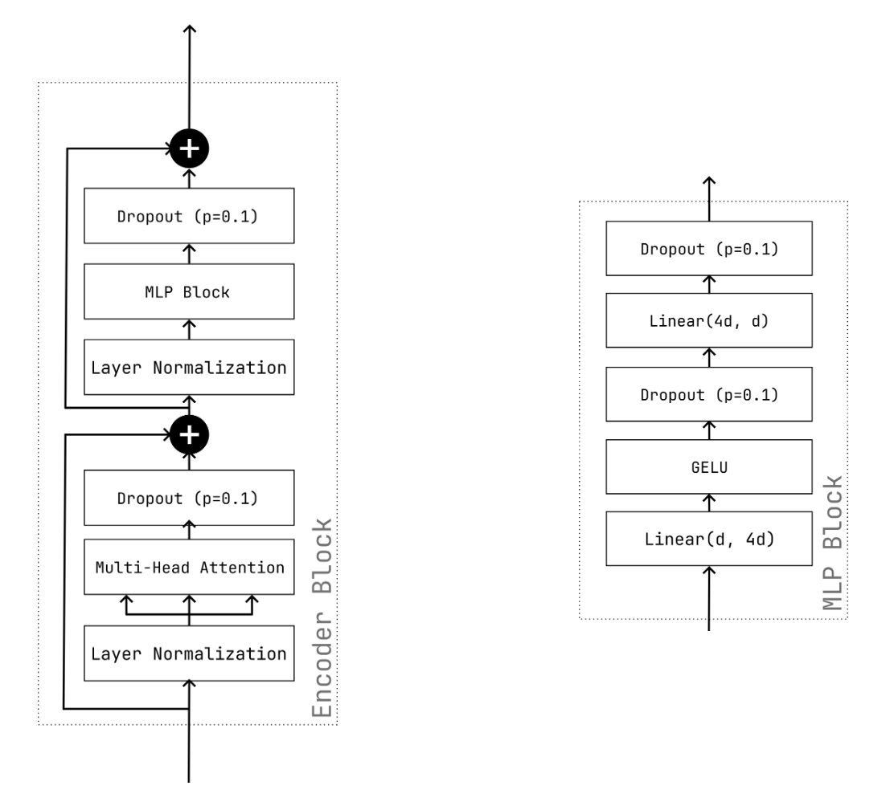

# Part 1: Encoder-only Model for Movie Review Sentiment Classification

## 1. Pre-processing and Tokenization of the IMDb Reviews

The IMDb dataset contains 50,000 movie reviews labelled as either *positive* or *negative*. We used 25,000 reviews for training, 5,000 for validation, and 20,000 for testing (the validation split was taken from the original test set using a fixed seed).

**Pre-processing.** Each review is cleaned in three steps:

1. HTML tags such as ` ` are stripped with a regular expression.
2. Special characters are removed, keeping only letters, digits, spaces and the punctuation `,.!?`.
3. The text is lowercased.

This removes noise introduced by the HTML-formatted source while preserving punctuation that may carry sentiment information.

**Tokenization.** We use a **word-level tokenizer** from the `tokenizers` library with a `Whitespace` pre-tokenizer. The tokenizer is trained on the (pre-processed) training set with three special tokens:

- `[PAD]` – used for padding shorter sequences to the same length.
- `[UNK]` – used for out-of-vocabulary words.
- `[CLS]` – prepended to every sequence; its final embedding is used as the sentence representation for classification.

To keep the vocabulary small we set `min_frequency=10` and `vocab_size=10 000`, so rare words get mapped to `[UNK]`.

**Dataset class.** In `IMDBDataset.__getitem__` each review is encoded, truncated to `max_length - 1` tokens, prepended with the `[CLS]` id and padded up to `max_length = 256` with `[PAD]`. The method returns a tensor of token ids and the integer label. A histogram of token lengths on the training set showed that 256 tokens covers the majority of reviews while keeping the model tractable.

## 2. The Encoder-only Transformer and Attention

The model is built from the building blocks described in *Attention is All You Need* (Vaswani et al., 2017). Its forward path is:

1. **Embedding layer** – maps token ids to vectors of dimension `embedding_dim = 96`.
2. **Sinusoidal positional encoding** – pre-computed once using
   `pe[:, 2i] = sin(pos / 10000^(2i/d))` and `pe[:, 2i+1] = cos(pos / 10000^(2i/d))`,
   and added to the embeddings so the model knows token positions.
3. **Stack of `num_layers = 3` Encoder Blocks**, each consisting of:
   - `LayerNorm` → `MultiHeadAttention` (with padding mask) → Dropout → residual
   - `LayerNorm` → MLP (`Linear(d, 4d)` → GELU → Dropout → `Linear(4d, d)` → Dropout) → residual
4. **Classification head** – we take the final embedding of the `[CLS]` token (position 0), pass it through a linear layer with a single output, and apply sigmoid to get a probability in [0, 1].

*Figure 1: One encoder block. The input is first normalized and passed through multi-head self-attention followed by dropout before the residual connection, then normalized again and passed through the position-wise MLP (`Linear → GELU → Dropout → Linear → Dropout`) before a second residual connection. Dropout is applied after each sub-layer output (and inside the MLP after the activation) to regularize training; at inference it is a no-op. We stack three of these blocks before the `[CLS]` token is read off and fed to the classification head.*

**Scaled dot-product attention.** For queries `Q`, keys `K` and values `V`,

`Attention(Q, K, V) = softmax(QKᵀ / √d_k) V`.

We compute `Q`, `K`, `V` by three linear projections of the input, reshape them to `(batch, num_heads, seq_len, head_dim)` so that all `num_heads = 4` heads are computed in parallel, and then concatenate the heads before a final linear projection. The padding mask (a boolean tensor with `True` at padding positions) is broadcast to the attention scores and used with `masked_fill(..., -inf)` so padding positions receive zero weight after softmax.

## 3. Approach to the Tasks

- **Task 1 (`IMDBDataset.__getitem__`).** Encode, truncate to `max_length - 1`, prepend `[CLS]`, right-pad with `[PAD]`.
- **Task 2 (`create_mask`).** Return `sequences == pad_id` as a boolean tensor of shape `(batch, seq_len)`.
- **Task 3 (`MultiheadAttention`).** Implemented from scratch using only one `nn.Linear` for each of Q, K, V and one for the output projection. Heads are handled with `view` + `transpose` rather than separate per-head layers, which is faster.
- **Task 4 (`EncoderBlock`).** Pre-norm variant: `x + Dropout(Attn(Norm(x)))` then `x + Dropout(MLP(Norm(x)))`, matching Figure 1 in this report.
- **Task 5 (`PositionalEncoding`).** Pre-computed in `__init__` with vectorized `torch.arange` / `torch.sin` / `torch.cos`, stored via `register_buffer` (so it moves with the model to the correct device), and added to the input in `forward`.
- **Task 6/7 (Training & Evaluation).** Trained for 3 epochs with AdamW (`lr = 1e-3`, `weight_decay = 1e-3`), `BCELoss`, gradient clipping at 10.0, batch size 64. The total model has **1,295,617 parameters**.
- **Task 8 (Custom reviews).** Wrote `classify_review` which preprocesses, tokenizes and pads the review in the same way as the training pipeline and then returns the predicted sentiment and probability.

## 4. Results

| Epoch | Train Loss | Train Acc. | Val Loss | Val Acc. |
|-------|-----------|-----------|----------|----------|
| 1     | 0.5351    | 0.7120    | 0.4129   | 0.8106   |
| 2     | 0.3724    | 0.8331    | 0.3689   | 0.8368   |
| 3     | 0.3023    | 0.8726    | 0.3855   | 0.8406   |

**Test accuracy: 0.8358** on the held-out 20k reviews.

Training loss decreases monotonically across the three epochs, while validation accuracy keeps improving and lands inside the 80–85% range suggested in the project description. Validation loss, however, drops in epoch 2 and then ticks up slightly in epoch 3 (0.3689 → 0.3855) even as validation accuracy keeps rising, an early sign that the model is starting to become over-confident on some examples. The gap between training accuracy (87.3%) and validation accuracy (84.1%) in the final epoch is still moderate (~3 pp), so the over-fitting is mild after three epochs.

## 5. Discussion and Challenges

- The most subtle part was the **multi-head attention**. Getting the `view`/`transpose` order right so that the `num_heads` axis ends up in position 1 (and the `seq_len` axis in position 2) is easy to get wrong; a wrong reshape silently trains but collapses heads. Writing out the shapes on paper before coding helped.
- The **padding mask** also needs shape `(batch, 1, 1, seq_len)` when applied to scores of shape `(batch, heads, seq_len, seq_len)`. The broadcasting hides mistakes because PyTorch will happily broadcast wrong shapes silently if the sizes happen to line up.
- **Pre-norm vs. post-norm** in the encoder block: we used pre-norm (LayerNorm *before* attention / MLP), which tends to train more stably on small models than the original post-norm version.
- Training was run on UiB's HubroHub computer. Each epoch took about 16 seconds thanks to the small model and short max sequence length.
- The model still misclassifies reviews containing heavy sarcasm or mixed sentiment. A word-level tokenizer with `[UNK]` for rare words also means that ironic phrasing relying on uncommon words is partially erased before the model even sees it.

## 6. Custom Review Predictions

Three real reviews were picked from IMDb to stress-test the model. The rating next to each movie is the score the original reviewer gave the film out of 10.

| # | Movie (reviewer rating) | Review (shortened) | My sentiment | Model prediction | Probability(positive) |
|---|-------------------|--------------------|--------------|------------------|------------------------|
| 1 | Sharknado (4/10) | *"Sharknado is a disaster movie indeed! Disasters come in many forms. But none quite like this. It was awful, but funny! It indeed jump the shark."* | Mixed / ironic (mostly negative) | negative | 0.1228 |
| 2 | Interstellar (10/10) | *"Amongst the best movies of all time. The story, the acting, the script, the cinematography, the effects, the sound and the production as a whole is all absolute 10/10's. But what beats all of that is Hans Zimmers compositions. How he continues to churn out perfection to the senses is mindblowing."* | Positive | positive | 0.9930 |
| 3 | Superbad (5/10) | *"A pretty average teen, American comedy. I can respect that it kinda initiated the dumb, adult comedy era that included Ted, let's be cops, 21 jump Street among others, and maybe I would've enjoyed it better at a younger age but honestly not as good as the hype around it."* | Mildly negative / lukewarm | positive | 0.8257 |

**Observations.**

- The Sharknado review is deliberately ambiguous, it contains "disaster", "awful" and "jump the shark" (all negative signals) alongside "funny" (positive). The model picks up on the negative vocabulary and predicts *negative* at 0.1228. My own reading is that the review is sarcastically *positive* about a bad movie, so the model reaches a defensible but not quite "correct" conclusion, a classic sarcasm failure case for a bag-of-words-ish classifier.
- The Interstellar review is unambiguously positive, and the model is rightly very confident (0.9930). The strong sentiment words ("best", "perfection", "mindblowing") dominate despite the rarer filmmaking vocabulary around them.
- The Superbad review is the most interesting failure: it is lukewarm and leans mildly negative ("not as good as the hype around it"), yet the model predicts *positive* at 0.8257. The review is padded with positive-leaning filler ("I can respect that", "I would've enjoyed it", "comedy") and lists several other comedies by name ("Ted", "21 Jump Street"), which probably nudge the `[CLS]` representation toward the positive side. The mild hedging at the end is not strong enough to flip that back, so the model ends up confidently on the wrong side of the decision boundary.

Overall the results match expectations: solid performance on clearly-worded reviews, and the failure modes are exactly the ones you would expect from a small word-level encoder trained only on IMDb: sarcasm, lukewarm/mixed sentiment, and unusual vocabulary.
